<div align="center">

<picture>
  <source media="(prefers-color-scheme: dark)" srcset="./assets/s15-rotate-dark.svg">
  <source media="(prefers-color-scheme: light)" srcset="./assets/s15-rotate-light.svg">
  
</picture>

</div>

<br>

```
$ whoami
chayapol@s15-garage
--------------------
OS         : Human (Thailand Edition)
Name       : Chayapol Suriyajan
Location   : Thailand
Born       : 2011-10-01
School     : Satit CMU Demonstration School (DEMON 57)
Languages  : JavaScript, TypeScript, Python, GDScript, HTML
Status     : still learning, still building
--------------------
$ _
```

### `ls ~/projects`

| | |
|---|---|
| [phantom-traffic-jams](https://github.com/chayapolsuriyajan-stack/phantom-traffic-jams) | Why traffic jams appear out of nothing — IDM + Nagel-Schreckenberg simulator ([demo](https://chayapolsuriyajan-stack.github.io/phantom-traffic-jams/)) |
| [AquaMonitor](https://github.com/chayapolsuriyajan-stack/AquaMonitor) | Water-quality checker ([live](https://water-quality-checker-five.vercel.app)) |
| [berretta](https://github.com/chayapolsuriyajan-stack/berretta) / [berretta-web](https://github.com/chayapolsuriyajan-stack/berretta-web) | Spaghetti-western FPS — Godot source, plus a self-contained Three.js browser port |
| [scratch-ai-ide](https://github.com/chayapolsuriyajan-stack/scratch-ai-ide) | Scratch 3 editor an AI drives over MCP — goboscript text ⇄ blocks, WebGPU-accelerated custom blocks, and a tic-tac-toe AI that learns by reinforcement (exports to vanilla Scratch) |
| [minicode](https://github.com/chayapolsuriyajan-stack/minicode) | ~10 MB VS Code-style IDE — Tauri shell, Monaco editor, real extension API |
| [rubiks-graph-wallpaper](https://github.com/chayapolsuriyajan-stack/rubiks-graph-wallpaper) | Live wallpaper: a Rubik's Cube scrambles and solves itself beside the permutation graph of its 54 stickers |
| [StarWallpaper](https://github.com/chayapolsuriyajan-stack/StarWallpaper) | Live wallpaper: the real night sky turning around the north celestial pole as a star-trail photo |
| [sax2sheet](https://github.com/chayapolsuriyajan-stack/sax2sheet) | Local tool: audio (YouTube/URL/upload) to saxophone-readable sheet music |
| [steam-market-best-deal](https://github.com/chayapolsuriyajan-stack/steam-market-best-deal) | Chrome extension: float-adjusted Best Deal sort + price watches for the Steam Community Market |
| [amath-platform](https://github.com/chayapolsuriyajan-stack/amath-platform) | A-Math number crossword with 6-digit room multiplayer and local match history |

<sub>Car render based on the [2010 Vertex Edge Nissan S15 Silvia](https://sketchfab.com/3d-models/2010-vertex-edge-nissan-s15-silvia-1edf4f37e6284bdaa6df0f9572389875) 3D model by [Ddiaz Design](https://sketchfab.com/ddiaz-design), licensed [CC BY-NC-SA](https://creativecommons.org/licenses/by-nc-sa/4.0/).</sub>
